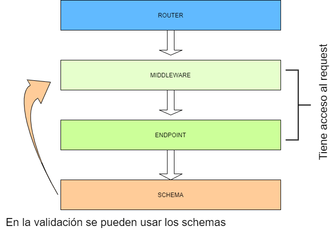

= Estructura general Auth - Plugins
:toc: left
:toc-title: Table of content

Arquitectura por capas.

'''

'''
Las capas son:

- router: Puntos de entrada a cada endpoint.
- middleware: Actúan como filtros y son trozos código muy específicos, que
    ayudan a la lógica del negocio.
- endPoint: La logica principal se encuentra aquí.
- schemas: Funciona como un modelo de datos. En este a manera de active record se puede encontrar
    algunas consultas demasiado grandes para la capa de endPoint.

Para priorizar la flexibilidad y la rapidez de desarrollo en los schemas se uso Active Record,con la ayuda de métodos static,
los esquemas son capaces de manejar lógica y devolver consultas más complejas.

[NOTE]
====
La principal característica en este desarrollo es el uso de la inyección de dependencia,
para usar librerias y demas archivos procure usar esta técnica.
====

include::openapi.adoc[]

include::middleware.adoc[]

include::error.adoc[]

include::validation.adoc[]

include::BD.adoc[]

include::converter.adoc[]

include::test.adoc[]

== Uso de AsciiDoc

Esta es una libreria usada para generar documentación dinamicamente , con la ayuda de comandos en nodejs.

https://asciidoctor.org/docs/asciidoc-syntax-quick-reference/[Asciidoctor]
